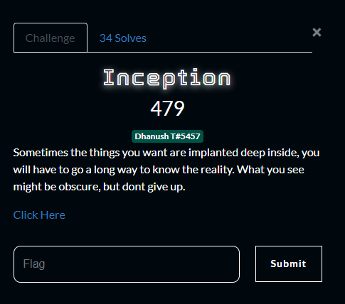
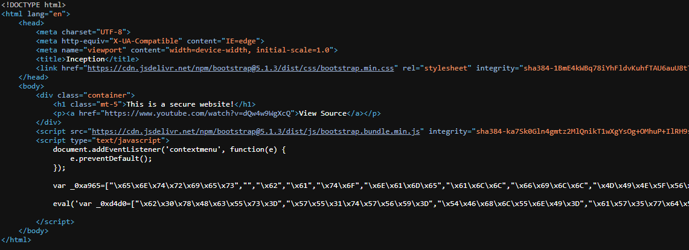
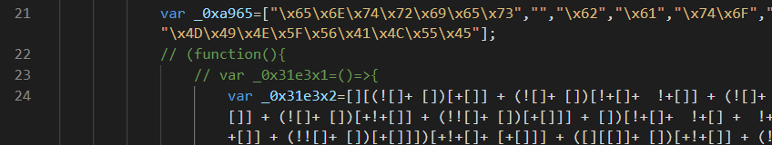
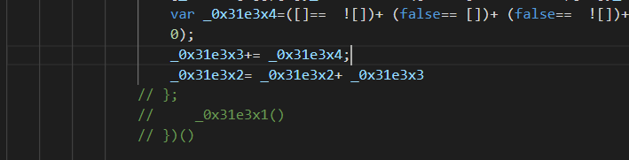
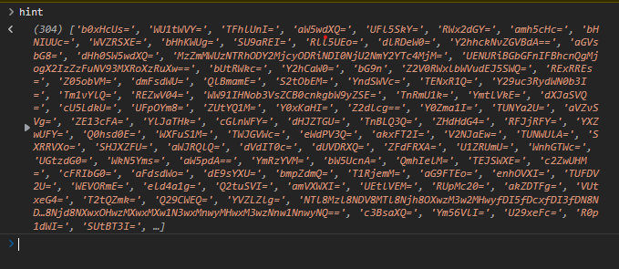
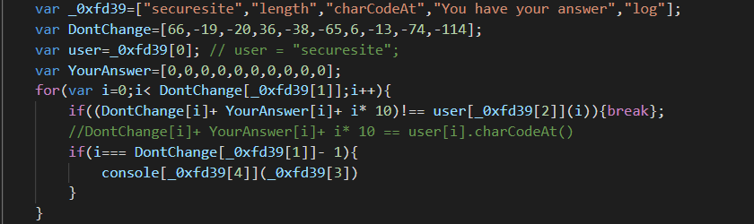
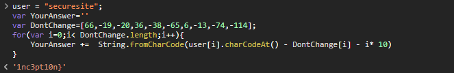

# Inception
## Description

> Sometimes the things you want are implanted deep inside, you will have to go a long way to know the reality. What you see might be obscure, but dont give up.

[Click Here](./Inception.html)

## Solution

- Kiểm tra mã nguồn của trang web ta thấy được những nội dung cần quan tâm nằm ở thẻ javascript

- Lưu mã source code về máy dưới dạng html và mở bằng visual code để có thể dễ theo dõi hơn
- Comment tên hàm đầu tiên để kiểm tra giá trị của các biến _0x31e3x2, _0x31e3x3, _0x31e3x4

- Mở lại trang html đã sửa bằng trình duyệt và kiểm tra giá trị của các biến trong phần console. Ta nhận được một phần của flag: `_0x31e3x2 = 'p_ctf{INfjnity5'`

- `eval` là câu lệnh thực thi lệnh từ một chuỗi (tìm hiểu thêm [tại đây](https://developer.mozilla.org/en-US/docs/Web/JavaScript/Reference/Global_Objects/eval)), do đó để debug chúng ta có thể comment lại lệnh eval và thực hiện lệnh nằm bên trong.
- Trong đoạn code này chúng có mảng chúng ta cần quan tâm là _0xd4d0, hint, trong đó `hint[] = _0xd4d0[0..304] `
    
        _0xd4d0[304] = 'var _0xfd39=["securesite","length","charCodeAt","You have your answer","log"];var DontChange=[66,-19,-20,36,-38,-65,6,-13,-74,-114];var user=_0xfd39[0];var YourAnswer=[0,0,0,0,0,0,0,0,0,0];for(var i=0;i< DontChange[_0xfd39[1]];i++){if((DontChange[i]+ YourAnswer[i]+ i* 10)!== user[_0xfd39[2]](i)){break};if(i=== DontChange[_0xfd39[1]]- 1){console[_0xfd39[4]](_0xfd39[3])}}'

- hint là một mảng gồm nhiều chuỗi base64

- Decode base 64 ta nhận được một phần của flag: 
`PCTF Flag Part 2: _b3g1n5_w1th_4n_`

        for (i = 0; i<hint.length; i++){
            console.log(atob(hint[i]));
        }

- Để lấy được phần còn lại của flag chúng ta cần đọc phân tích nội dung của _0xd4d0[304]

- Ta tìm được `YourAnswer = '1nc3pt10n}'`

## Flag: p_ctf{INfjnity5_b3g1n5_w1th_4n_1nc3pt10n}
